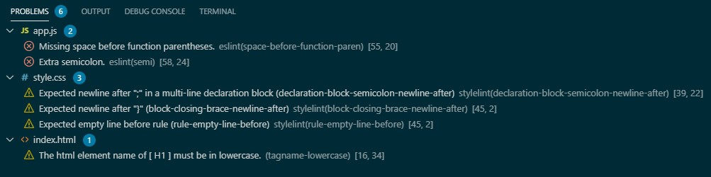
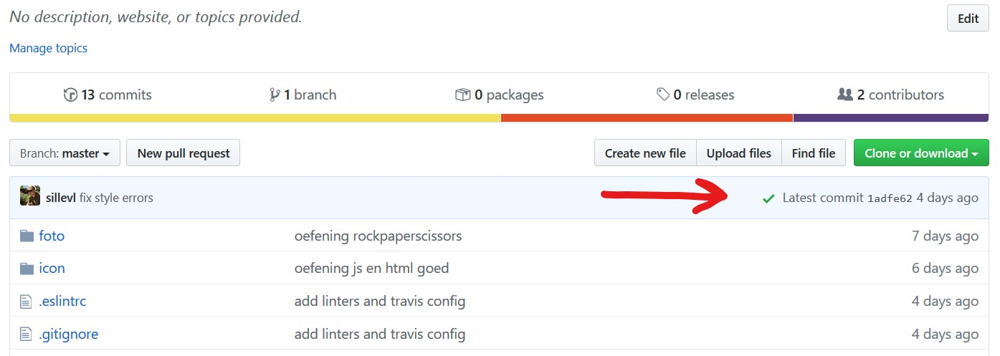
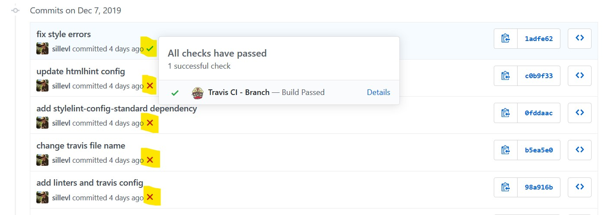
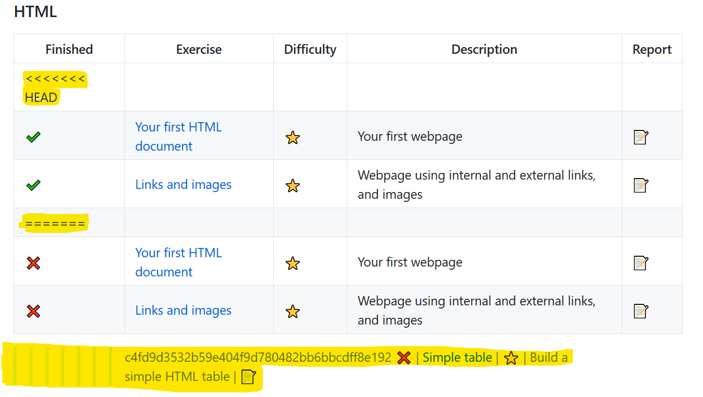
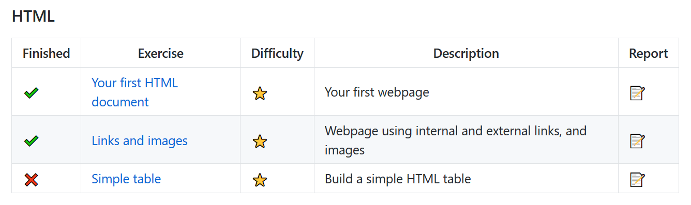

# Web Essentials Exercise Checklist

Project structure

* [ ] Use filenames without spaces. Use underscores `_` or dash `-` instead
* [ ] Use lowercase characters instead of capital letters for all files
* [ ] Your main HTML file should be called `index.html`. Each project should at least have 1 file called `index.html`
* [ ] All `.css` files should be located inside a `css/` folder. Never in the root folder.
* [ ] All `.js` files should be located inside a `js/` folder. Never in the root folder.
* [ ] All images files should be located inside a `img/` or `image/` folder. Never in the root folder

Reports

* [ ] always add your name to the `README.md` or `REPORT.md` when asked for. Look for the hidden comments in your text editor or raw view of GitHub
* [ ] always add an URL when asked for in the `README.md` or `REPORT.md` files. Look for the hidden comments in your text editor or raw view of GitHub
* [ ] Update the checkmarks in the `web-essentials-practical` project to match your finished projects.

Code style

* [ ] Always check _all_ your HTML files with the [HTML validator](https://validator.w3.org/)
* [ ] Always check _all_ your CSS files with the [CSS validator](http://jigsaw.w3.org/css-validator/)

Other

* [ ] Make sure to push your solutions to GitHub. Always check your GitHub's project page to see if everything is pushed correctly.

It is also possible to check your code style with a set of tools in the command line. These tools are called `linters`. Check out the [linter chapter](#linters) below to get more details on how to use them.

## Linters

* [Setup](#setup)
* [Commands](#commands)
* [Checks on GitHub](#checks-on-github)
* [Checks in VS Code](#checks-in-vs-code)

Linters in software are tools that analyze and find problems in source code. They can flag programming errors, bugs and suspicious constructs. They can also define rules on how to style code, resulting in more readable and understandable code. This results in code of multiple developers to look as if it was written by one single person. This will become important when working together on the same projects.

### Setup

Before you can start using these offline command line tools you need to make sure everything is ready, configured and installed. The project already contains all the configuration, but the libraries need to be installed using the command line.

#### Configuration files

Before starting make sure the following files are available in your project directory:

* `.gitignore`: Ignore packages with git. These should never be committed.
* `package.json`: Configuration file containing all the packages that need to be installed. Defines the scripts that can be run and contains the JavaScript linter configuration
* `.htmlhintrc`: Configuration for the HTML linter
* `.stylelintrc.json`: Configuration for the CSS linter
* `.markdownlint.json`: Configuration for the Markdown linter
* `.github/`: Automatically run the linters on GitHub as well. If all goes well, you earn a  ✔️ next to your commit.

Be sure to have the latest updates pulled in your project. First check with a `git pull ...` command to see if the teacher added or changed the files to the project.

#### NodeJS

To use these linters, we need to install some extra software first. The linters are written in JavaScript and need **NodeJS** to run on a computer.

First check if you have node already installed.

```bash
node --version
```

If you get a version number, then Node is installed. If you get an error message, you will need to install Node.js first from [https://nodejs.org](https://nodejs.org). When ready try the command above to verify that Node is installed correctly.

#### NPM Packages

The different linters are available in different packages. To install them you need to run the following command in every project directory where you want to use the linters.

```bash
npm install
```

This command will download and install all the needed packages and tools to run the linters.

### Commands

#### HTML

```bash
npm run lint-html
```

If all goes well, you should get this output:

```bash
❯ npm run lint-html

> @ lint-html D:\VIVES\my-project
> htmlhint --warn


   Config loaded: D:\VIVES\my-project\.htmlhintrc

Scanned 1 files, no errors found (55 ms).
```

If any errors or warnings are displayed, please fix them.

#### CSS

```bash
npm run lint-css
```

If all goes well, you should get this output:

```bash
❯ npm run lint-css

> @ lint-css D:\VIVES\my-project
> stylelint **/*.css
```

If any errors or warnings are displayed, please fix them.

#### JavaScript

```bash
npm run lint-js
```

if all goes well, you should get this output:

```bash
❯ npm run lint-js

> @ lint-js D:\VIVES\my-project
> eslint "**/*.js"
```

If any errors or warnings are displayed, please fix them.

#### Markdown

```bash
npm run markdown-lint
```

If all goes well you should get this output:

```bash
❯ npm run lint-markdown

> @ lint-markdown D:\VIVES\my-project
> markdownlint **/*.md
```

If any errors or warnings are displayed, please fix them.

#### Running all the linters

You can run all linters at once with the following command:

```bash
npm run all
```

### Checks in VS Code

It is also possible to see all violations, warnings and errors in Visual Studio Code. The messages are displayed in the `Problems` tab. You can toggle the problems tab with the `CTRL-SHIFT-M` shortkey.

It will show something like this:



In order to run the linters inside VS Code, you need to install the correct [Extensions](https://marketplace.visualstudio.com/).

* [HTMLHint](https://marketplace.visualstudio.com/items?itemName=mkaufman.HTMLHint)
* [Stylelint](https://marketplace.visualstudio.com/items?itemName=stylelint.vscode-stylelint)
* [ESLint](https://marketplace.visualstudio.com/items?itemName=dbaeumer.vscode-eslint)
* [Markdownlint](https://marketplace.visualstudio.com/items?itemName=DavidAnson.vscode-markdownlint)

You can install them using the commandline as well using the following commands.

```bash
code --install-extension mkaufman.htmlhint
code --install-extension stylelint.vscode-stylelint
code --install-extension dbaeumer.vscode-eslint
code --install-extension davidanson.vscode-markdownlint
```

### Checks on GitHub

You can even run the linters when uploading (pushing) your code to GitHub. This is done automatically if an `.github/workflows` is present in your project.

It takes a minute or two to see the results. The results are shown next to your commit messages on GitHub.

Note that the checkmark only will show ✔️ if ALL checks succeed. When your project contains the smalles error or warning, you will see a ❌



Or in your commit history.



This allows you to see when you introduce any problems, and when they are fixed.

## Mergeconflict

Please solve any mergeconflicts that may occur in your project.

A mergeconflict might look like this:



Make the nesecairy changes in the sourcecode to get everything correctly formated. The result should look like this:



Note !

You can always preview your Markdown files inside vscode using the `Markdown: Open Preview on the Side` command (press `F1` or `CTRL-SHIFT-P` to open the command window). You can also use the `CTRL-K V` shortkeys
